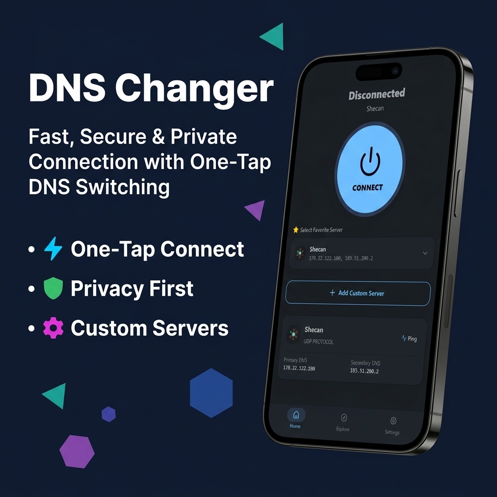
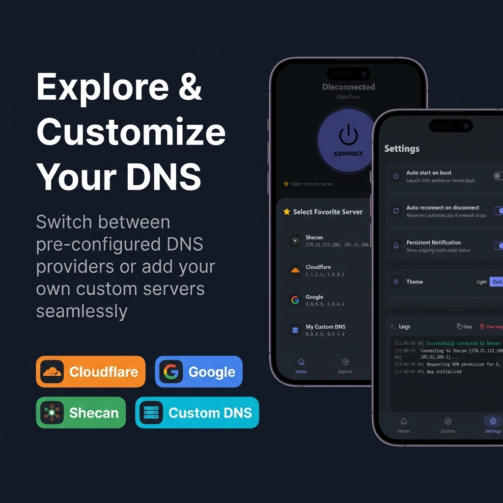

# DNS Changer Mobile



Open-source mobile application for changing and managing DNS servers with speed, security, and custom protocol support (UDP, DoH, DoT).

Part of the **DnsChanger** open-source ecosystem.
- Desktop version: [dnsChanger-desktop](https://github.com/DnsChanger/dnsChanger-desktop/)
- Mobile version: [dnschanger-mobile](https://github.com/DnsChanger/dnschanger-mobile)

---

## Features & Screenshots



---

## Key Features

- **Fast Connection:** One-tap connect to secure and fast DNS servers.
- **Custom DNS Support:** Easily add custom DNS servers (Plain UDP, DoH - HTTPS, DoT - TLS).
- **Favorite Servers:** Star servers to add them to your main screen.
- **Explore Remote DB:** Automatically synced DNS servers repository.
- **Quick Disconnect Notification:** System notification tray action for quick disconnection.
- **Cross-Platform Base:** Built with React, TypeScript, Tailwind CSS, DaisyUI, and Capacitor.


## Getting Started

### Prerequisites

- Node.js (v18+) or Bun
- Android Studio & Android SDK (for native Android builds)

### Installation

```bash
git clone https://github.com/DnsChanger/dnschanger-mobile.git
cd dnschanger-mobile
bun install
```

### Development

```bash
bun run dev
```

### Build for Android

```bash
bun run build
bun run cap:sync
cd android
./gradlew assembleRelease
```

---

## License

This project is open-source under the [MIT License](LICENSE).
